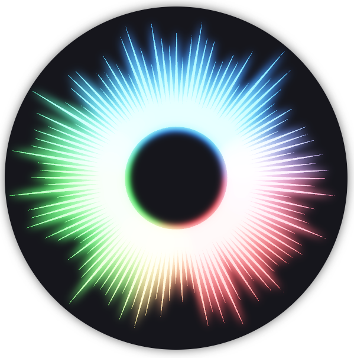

# Iris Indicator

> A study to implement a loading/progress indicator fully in WebGL. [View a demo here (requires a modern browser)](https://nathanlesage.github.io/iris-indicator).

The Iris Indicator is a loading indicator that can display a dynamic state while conveying a perception of movement. It is fully implemented using WebGL and offers a plethora of settings to adjust its behavior.

> [!NOTE]
> While the indicator is fully functional, it is not optimized for broad browser support and I do not give any guarantee whether it will work or not. It may break at any time. It is simply a study to learn some WebGL and writing shaders.

## Features

* Displays an iris-like circular structure, with segments colored differently to convey state
* Includes animations for rotation, ray movement, and segment colors
* Implements a bloom effect for conveying a sense of brightness
* Includes MSAA for sharp edges
* FPS limiter to save on resources
* Almost everything is configurable

[View the demo (requires a modern browser)](https://nathanlesage.github.io/iris-indicator/index.htm).

## Background

Some time in 2025 I had a peculiar problem. For my app, Zettlr, I needed a way to visualize long-running tasks in a compact way while also indicating to the user that something is happening in the background. This problem had some unique requirements, such as:

* Convey a sense of movement
* Be extremely compact
* Dynamic updating
* Represent running, successful, and failed tasks at the same time

At some point, my brain produced the idea of an iris- or sun-like circular indicator with colored segments. The indicator itself would be animated and move to convey a sense of motion, and to signal to the user that *something* is happening in the background. At the same time, the various segments of the indicator would be colored differently to indicate the current status of all tasks, including still-running tasks (blue), successful tasks (green), and failed tasks (red).

At the same time, I had the sense that I wanted to make the iris appear "bright," which immediately brought to mind a bloom filter that we know from video games, and whose purpose is to convey a sense of brightness.

This is when I decided that I would want to use this opportunity to implement the entire thing completely in WebGL, which would allow me pixel-perfect control at reasonable performance.

At Christmas 2025, I sat down in my free time to code up this study. It turned out to be *a lot* more complex than I thought, but the end result is – in my opinion – very pretty.

[Read the full story on my website](https://www.hendrik-erz.de/post/a-rabbit-hole-called-webgl)

## Stack

This entire project has been originally written in plain JavaScript with WebGL 1/GLSL 2. After the proof-of-concept, it has been converted to TypeScript and moved to WebGL 2 and GLSL 3.

The build pipeline is relatively straightforward. It uses the TypeScript compiler to convert the TS source to JS, and then uses WebPack to bundle it into a single library file, `indicator.js`.

## Overview over the Repository

I have ensured to comment the code as much as possible. Here, I document which file does what. All of the relevant files reside in the `src`-directory. They can be compiled down to a single `indicator.js` using Webpack.

The entire, fully-assembled indicator library weighs about 72kb, which is quite heavy for such a single-use component, but it demonstrates its complexity.

### Folders

This repository contains a set of folders.

* `dist` contains the compiled version of the library, with typings. Note that this compiled version also includes the UI code for the demo page. It is not intended to be installed as a library. This may or may not change in the future.
* `src` contains the actual source code; the "meat" of the project.

In the following, I introduce each of the relevant source files individually. They are heavily commented to enable the reader to understand what is happening.

### `index.html`

This file at the root of the repository contains the demo page source code. It loads the built `indicator.js` file from the `dist` repository and uses it to display the indicator demonstration.

### `index.ts`

The entry point. It sets up some global state so that users can adjust settings, hooks the UI elements, and starts the indicator animation.

### `ui.ts`

Includes code to hook the input elements in the `index.html` to the global state which allow the user to customize the settings.

### `iris-indicator.ts`

This contains the indicator class. Each class takes in a HTML canvas element and renders an indicator in it. This class also maintains the state, i.e., how many segments to display in which color.

### `webgl-engine.ts`

This contains the engine class. The engine is used by the indicator to actually draw things onto the canvas. It implements the nitty-gritty of the WebGL code that is required to animate the thing.

### `util/math.ts`

Contains a few utility functions that make wrangling the math required for the indicator easier. Many of these functions have been adapted from examples provided by WebGL fundamentals.

### `util/webgl.ts`

Contains a few utility functions for working with WebGL peculiarities easier. Many of these functions have been adapted from examples provided by WebGL fundamentals.

### `shaders/vertex_shader.glsl`

Contains the source code for the vertex shader. The vertex shader essentially simply produces screen-coordinates from the provided triangle data, and calculates the corresponding texture position for the fragment shader.

### `shaders/fragment_shader.glsl`

Contains the source code for the fragment shader. This shader takes in a texture coordinate and generates or transforms the color information from the provided textures. Note that the organization of this shader may seem somewhat odd. Oftentimes, programs (such as games) utilize many different vertex/fragment shader pairs, each of which does only one task. To keep the file and folder structure simple, I only created a single vertex/fragment shader pair. The fragment shader thus essentially contains five separate fragment shaders. I steer which function is actually being performed using a `const enum` of floats that I control from the WebGL code.

## Resources

This work wouldn't have been possible without the effort of many people who have provided resources, ideas, and inspiration for how to implement various techniques in WebGL. The following lists the most crucial resources I consulted for this project, but probably omits many obscoure StackOverflow threads that I have consulted in between and simply forgotten about.

* [WebGLFundamentals](https://webglfundamentals.org/): Contains many simple and easy to understand examples and explanations for how WebGL/OpenGL actually works
* [WebGL2Fundamentals](https://webgl2fundamentals.org/): Similar to WebGLFundamentals, but includes explanations on what has changed between WebGL1 and WebGL2 and was immensely helpful in porting my initial shaders to GLSL 3.
* [WebGL Framebuffer Multisampling (StackOverflow)](https://stackoverflow.com/questions/47934444/webgl-framebuffer-multisampling): This was the crucial piece of information to understand how MSAA works.
* [Learn OpenGL / Bloom](https://learnopengl.com/Advanced-Lighting/Bloom): A great explainer that helps to implement a bloom effect
* [Learn OpenGL / Anti Aliasing](https://learnopengl.com/Advanced-OpenGL/Anti-Aliasing): A great explainer for what Anti-Aliasing is and how it works. Together with the SO-thread above, it helped me implement MSAA.

## License

&copy; 2025 Hendrik Erz. This repository is licensed under GPL 3.0 only. See the [LICENSE](./LICENSE) file for more information.

